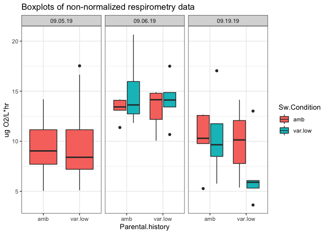
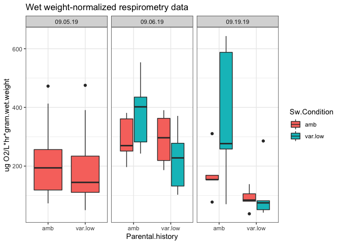
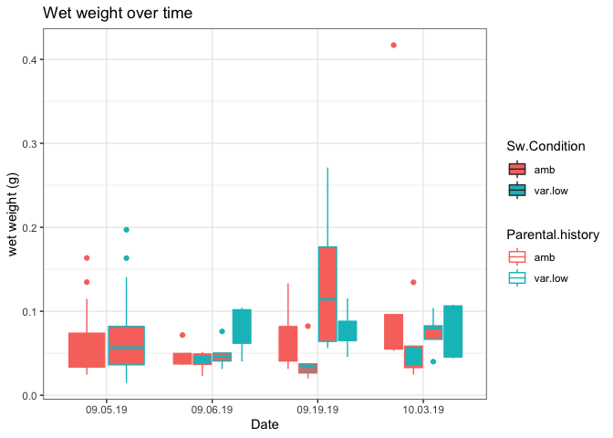

Resp.Calculations.ST
================
Shelly Trigg
9/30/2019

Load libraries

``` r
## load libraries
library(readxl)
library(devtools)
```

    ## Loading required package: usethis

``` r
library(dplyr)
```

    ## 
    ## Attaching package: 'dplyr'

    ## The following objects are masked from 'package:stats':
    ## 
    ##     filter, lag

    ## The following objects are masked from 'package:base':
    ## 
    ##     intersect, setdiff, setequal, union

``` r
library(ggplot2)
```

Read in and format size and weight data

``` r
Size.Info <- read_xlsx("~/Documents/GitHub/P_generosa/amb_v_varlowpH_juvis/data/Shell_length_data.xlsx") #read Size.info data
#format date column
Size.Info$Date <- format(as.POSIXct(strptime(Size.Info$Date, format ="%Y%m%d")),format="%m.%d.%y")
```

Read in and format cumulative respirometry data

``` r
# call the cumulative resp table of Lolin raw outputs
cumulative_resp_table <- read.csv(file="~/Documents/GitHub/P_generosa/amb_v_varlowpH_juvis/data/SDR/Cumulative_resp_alpha0.4.csv", header=T, stringsAsFactors = FALSE) #read Size.info data
#format date column
cumulative_resp_table$Date <- format(as.POSIXct(cumulative_resp_table$Date,format="%m.%d.%y"),format="%m.%d.%y")
```

Merge size and weight data with respirometry data

``` r
x <- merge(cumulative_resp_table, Size.Info, by=c("Date","SDR_position", "Run"))
```

**Analyze blanks**

``` r
#subset respirometry data for blanks data
blanks_total <- x[which(x$Type == "blank"),]
#create ID column to distinguish individual data points
blanks_total$ID <- paste(blanks_total$Date,blanks_total$Run, blanks_total$SDR_position, sep = ".")
#plot distributions of blank data points and see if any are outliers
ggplot(blanks_total, aes(x = Date, y = Lpc, color = as.factor(Run))) + geom_point() + theme_bw() + ggtitle("Raw resp. rate in blanks") + ylab("Raw respiration rate (Lpc slope)")
```


``` r
#see if removing outliers makes a tighter distribution
#create data frame with mean and standard deviations for each model
test <- blanks_total %>% group_by(Date,Run,Sw.Condition) %>% summarise(n = n(), mean.lpc = mean(Lpc), mean.leq = mean(Leq), mean.lz = mean(Lz), sd.lpc = sd(Lpc), sd.leq = sd(Leq), sd.lz = sd(Lz))
#review any groups with large standard deviation
test
```

    ## # A tibble: 7 x 10
    ## # Groups:   Date, Run [5]
    ##   Date    Run Sw.Condition     n mean.lpc mean.leq mean.lz  sd.lpc sd.leq
    ##   <chr> <int> <chr>        <int>    <dbl>    <dbl>   <dbl>   <dbl>  <dbl>
    ## 1 09.0…     1 amb              4   -0.294   -0.294  -0.239 0.258   0.254 
    ## 2 09.0…     2 amb              4   -0.427   -0.453  -0.453 0.129   0.108 
    ## 3 09.0…     3 amb              4   -0.419   -0.409  -0.493 0.0358  0.0398
    ## 4 09.0…     1 amb              2   -0.954   -0.972  -0.969 0.0667  0.0595
    ## 5 09.0…     1 var.low          2   -0.490   -0.766  -0.766 0.483   0.109 
    ## 6 09.1…     1 amb              2   -0.418   -0.428  -0.424 0.00902 0.0232
    ## 7 09.1…     1 var.low          2   -0.679   -0.498  -0.642 0.244   0.0481
    ## # … with 1 more variable: sd.lz <dbl>

``` r
#now check plots from Resp.LoLin.ST.R to see if models are weird or if trend is abnormal
#exclude blanks that seem weird
blanks_total_filtered <- blanks_total[which(blanks_total$ID != "09.05.19.1.C5" & blanks_total$ID != "09.05.19.1.B5" & blanks_total$ID != "09.05.19.2.B5" & blanks_total$ID != "09.06.19.1.A6" & blanks_total$ID != "09.19.19.1.A1"),]
#create data frame with mean and standard deviations for each model without weird data points
avg.blank <- blanks_total_filtered %>% group_by(Date,Run) %>% summarise(n = n(), mean.lpc = mean(Lpc), mean.leq = mean(Leq), mean.lz = mean(Lz), sd.lpc = sd(Lpc), sd.leq = sd(Leq), sd.lz = sd(Lz))
#review blank averages
avg.blank
```

    ## # A tibble: 5 x 9
    ## # Groups:   Date [3]
    ##   Date       Run     n mean.lpc mean.leq mean.lz sd.lpc sd.leq  sd.lz
    ##   <chr>    <int> <int>    <dbl>    <dbl>   <dbl>  <dbl>  <dbl>  <dbl>
    ## 1 09.05.19     1     2   -0.516   -0.513  -0.411 0.0193 0.0240 0.284 
    ## 2 09.05.19     2     3   -0.363   -0.401  -0.401 0.0282 0.0318 0.0318
    ## 3 09.05.19     3     4   -0.419   -0.409  -0.493 0.0358 0.0398 0.119 
    ## 4 09.06.19     1     3   -0.913   -0.929  -0.927 0.0847 0.0855 0.0825
    ## 5 09.19.19     1     3   -0.448   -0.440  -0.437 0.0515 0.0265 0.0297

**Calculate Respiration Rate**

``` r
#----------------------------Respiration rate calculation -------------------------------------------

#merge respirometry sample data with average blank data
CALC.table <- merge(avg.blank[,c("Date","Run", "mean.lpc")],x, by=c("Date","Run")) 

#remove lines with NA
CALC.table <- CALC.table[which(CALC.table$Wet.weight.g != "NA"),]

#convert length and wet weight fields to numeric
CALC.table$Length <- as.numeric(CALC.table$Length)
CALC.table$Wet.weight.g <- as.numeric(CALC.table$Wet.weight.g)

# NOTE: the raw data is in umol L-1 4ml-1
# "resp.RAW.µgLhr" calculation = ((((((abs(Lpc)) - (BLANK.mean.Lpc))*(4/1000))*(60))*31.998))
# (1) corrects for blank (2) converts to Liters (3) converts to hours (4) converts moles to grams; final unit = µg O2 L-1 h-1


for(i in 1:nrow(CALC.table)) {
  CALC.table$resp.RAW.µgLhr[i] <-((((((abs(CALC.table[i,"Lpc"])) - (CALC.table[i,"mean.lpc"]))*(4/1000))*(60))*31.998))
  CALC.table$resp.shell[i] <- CALC.table$resp.RAW.µgLhr[i]/CALC.table[i,"Length"] #per cm shell length
  CALC.table$resp.weight[i] <- CALC.table$resp.RAW.µgLhr[i]/CALC.table[i,"Wet.weight.g"] #per gram wet weight
}
```

Write out calculated respirometry rates for blanks and for samples

``` r
#----------------------OUTPUT - save plots and cumulative tables-----------------------------------------

write.csv(blanks_total,"~/Documents/GitHub/P_generosa/amb_v_varlowpH_juvis/data/SDR/All.blank.resp.rates.csv", row.names=FALSE, quote = FALSE)
write.csv(CALC.table,"~/Documents/GitHub/P_generosa/amb_v_varlowpH_juvis/data/SDR/Final.resp.rates.csv", row.names=FALSE, quote = FALSE) 
```

**Boxplots non-normalized data**

``` r
#create a group category
CALC.table$hist.curr.treat <- paste(CALC.table$Parental.history,CALC.table$Sw.Condition, sep = "_")

ggplot(CALC.table, aes(x = Parental.history,y = resp.RAW.µgLhr, fill = Sw.Condition)) + geom_boxplot() +facet_wrap(~Date) + theme_bw() + ggtitle("Boxplots of non-normalized respirometry data") + ylab("ug O2/L*hr")
```



**Violin plots with boxplot insets and jitter points for non-normalized data**

``` r
ggplot(CALC.table, aes(x = hist.curr.treat,y = resp.RAW.µgLhr, fill = Sw.Condition)) + geom_violin(trim = FALSE) + geom_boxplot(width = 0.15) + geom_jitter(shape =16, size = 2,position= position_jitter(0.05)) +facet_wrap(~Date) + theme_bw() + ggtitle("Non-normalized respirometry data") + ylab("ug O2/L*hr") + xlab("parental_current treatment") + theme(axis.text.x = element_text(angle = 45, hjust = 1))
```


**anova on non-normalized data on Day 0 (Sept. 5 2019, before treatment started)**

``` r
#run anova for non-normalized data
#for Sept. 5 trial
a <- aov(resp.RAW.µgLhr ~ Parental.history, data = CALC.table[which(CALC.table$Date == "09.05.19"),])
summary(a)
```

    ##                  Df Sum Sq Mean Sq F value Pr(>F)
    ## Parental.history  1    0.3   0.347   0.039  0.844
    ## Residuals        55  490.7   8.922

**anova on non-normalized data on Day 1 (Sept. 6 2019)**

``` r
#for Sept. 6 trial
b <- aov(resp.RAW.µgLhr ~ Sw.Condition*Parental.history, data = CALC.table[which(CALC.table$Date == "09.06.19"),])
summary(b)
```

    ##                               Df Sum Sq Mean Sq F value Pr(>F)
    ## Sw.Condition                   1   8.64   8.637   1.428  0.250
    ## Parental.history               1   0.93   0.931   0.154  0.700
    ## Sw.Condition:Parental.history  1   0.86   0.857   0.142  0.712
    ## Residuals                     16  96.78   6.049

**anova on non-normalized data on Day 14 (Sept. 19 2019)**

``` r
#for Sept. 19 trial 
c <- aov(resp.RAW.µgLhr ~ Sw.Condition*Parental.history, data = CALC.table[which(CALC.table$Date == "09.19.19"),])
summary(c)
```

    ##                               Df Sum Sq Mean Sq F value Pr(>F)
    ## Sw.Condition                   1   9.04    9.04   0.696  0.416
    ## Parental.history               1  19.66   19.66   1.514  0.236
    ## Sw.Condition:Parental.history  1  15.59   15.60   1.201  0.289
    ## Residuals                     16 207.71   12.98

**Boxplots of shell length-normalized data **

``` r
ggplot(CALC.table, aes(x = Parental.history,y = resp.shell, fill = Sw.Condition)) + geom_boxplot() +facet_wrap(~Date) + theme_bw() + ggtitle("Shell length-normalized respirometry data") + ylab("ug O2/L*hr*cm.shell.length") 
```


**Violin plots with boxplot insets and jitter points for shell length-normalized data**

``` r
ggplot(CALC.table, aes(x = hist.curr.treat,y = resp.shell, fill = Sw.Condition)) + geom_violin(trim = FALSE) + geom_boxplot(width = 0.15) + geom_jitter(shape =16, size = 2,position= position_jitter(0.05)) +facet_wrap(~Date) + theme_bw() + ggtitle("Respirometry data normalized by shell length") + ylab("ug O2/L*hr*cm.shell.length") + xlab("parental_current treatment") + theme(axis.text.x = element_text(angle = 45, hjust = 1))
```


**anova on shell length-normalized data on Day 0 (Sept. 5 2019, before treatment started)**

``` r
#run anova for non-normalized data
#for Sept. 5 trial
a <- aov(resp.shell ~ Parental.history, data = CALC.table[which(CALC.table$Date == "09.05.19"),])
summary(a)
```

    ##                  Df Sum Sq Mean Sq F value Pr(>F)
    ## Parental.history  1    8.9    8.88   0.269  0.606
    ## Residuals        55 1818.6   33.06

**anova on shell length-normalized data on Day 1 (Sept. 6 2019)**

``` r
#for Sept. 6 trial
b <- aov(resp.shell ~ Sw.Condition*Parental.history, data = CALC.table[which(CALC.table$Date == "09.06.19"),])
summary(b)
```

    ##                               Df Sum Sq Mean Sq F value Pr(>F)
    ## Sw.Condition                   1   19.5   19.51   0.469  0.503
    ## Parental.history               1   58.3   58.29   1.402  0.254
    ## Sw.Condition:Parental.history  1   31.5   31.52   0.758  0.397
    ## Residuals                     16  665.0   41.56

**anova on shell length-normalized data on Day 14 (Sept. 19 2019)**

``` r
#for Sept. 19 trial 
c <- aov(resp.shell ~ Sw.Condition*Parental.history, data = CALC.table[which(CALC.table$Date == "09.19.19"),])
summary(c)
```

    ##                               Df Sum Sq Mean Sq F value Pr(>F)
    ## Sw.Condition                   1    9.9    9.89   0.108  0.746
    ## Parental.history               1  212.4  212.39   2.327  0.147
    ## Sw.Condition:Parental.history  1   68.7   68.71   0.753  0.398
    ## Residuals                     16 1460.2   91.27

**Boxplots of wet weight-normalized data **

``` r
ggplot(CALC.table, aes(x = Parental.history,y = resp.weight, fill = Sw.Condition)) + geom_boxplot() +facet_wrap(~Date) + theme_bw() + ggtitle("Wet weight-normalized respirometry data") + ylab("ug O2/L*hr*gram.wet.weight") 
```



**Violin plots with boxplot insets and jitter points for wet weight-normalized data**

``` r
ggplot(CALC.table, aes(x = hist.curr.treat,y = resp.weight, fill = Sw.Condition)) + geom_violin(trim = FALSE) + geom_boxplot(width = 0.15) + geom_jitter(shape =16, size = 2,position= position_jitter(0.05)) +facet_wrap(~Date) + theme_bw() + ggtitle("Respirometry data normalized by wet weight") + ylab("ug O2/L*hr*gram.wet.weight") + xlab("parental_current treatment") + theme(axis.text.x = element_text(angle = 45, hjust = 1))
```


**anova on wet weight-normalized data on Day 0 (Sept. 5 2019, before treatment started)**

``` r
#run anova for non-normalized data
#for Sept. 5 trial
a <- aov(resp.weight ~ Parental.history, data = CALC.table[which(CALC.table$Date == "09.05.19"),])
summary(a)
```

    ##                  Df Sum Sq Mean Sq F value Pr(>F)
    ## Parental.history  1   4072    4072   0.398  0.531
    ## Residuals        55 562660   10230

**anova on wet weight-normalized data on Day 1 (Sept. 6 2019)**

``` r
#for Sept. 6 trial
b <- aov(resp.weight ~ Sw.Condition*Parental.history, data = CALC.table[which(CALC.table$Date == "09.06.19"),])
summary(b)
```

    ##                               Df Sum Sq Mean Sq F value Pr(>F)  
    ## Sw.Condition                   1    624     624   0.060 0.8089  
    ## Parental.history               1  32759   32759   3.174 0.0938 .
    ## Sw.Condition:Parental.history  1  32005   32005   3.101 0.0973 .
    ## Residuals                     16 165119   10320                 
    ## ---
    ## Signif. codes:  0 '***' 0.001 '**' 0.01 '*' 0.05 '.' 0.1 ' ' 1

**anova on wet weight-normalized data on Day 14 (Sept. 19 2019)**

``` r
#for Sept. 19 trial 
c <- aov(resp.weight ~ Sw.Condition*Parental.history, data = CALC.table[which(CALC.table$Date == "09.19.19"),])
summary(c)
```

    ##                               Df Sum Sq Mean Sq F value Pr(>F)  
    ## Sw.Condition                   1  56236   56236   2.916 0.1070  
    ## Parental.history               1 147850  147850   7.667 0.0137 *
    ## Sw.Condition:Parental.history  1  38953   38953   2.020 0.1744  
    ## Residuals                     16 308529   19283                 
    ## ---
    ## Signif. codes:  0 '***' 0.001 '**' 0.01 '*' 0.05 '.' 0.1 ' ' 1

``` r
TukeyHSD(c)
```

    ##   Tukey multiple comparisons of means
    ##     95% family-wise confidence level
    ## 
    ## Fit: aov(formula = resp.weight ~ Sw.Condition * Parental.history, data = CALC.table[which(CALC.table$Date == "09.19.19"), ])
    ## 
    ## $Sw.Condition
    ##                 diff       lwr      upr     p adj
    ## var.low-amb 106.0532 -25.59641 237.7029 0.1070116
    ## 
    ## $Parental.history
    ##                  diff       lwr      upr     p adj
    ## var.low-amb -171.9593 -303.6089 -40.3096 0.0136886
    ## 
    ## $`Sw.Condition:Parental.history`
    ##                                   diff        lwr        upr     p adj
    ## var.low:amb-amb:amb          194.31778  -56.95134 445.586895 0.1619870
    ## amb:var.low-amb:amb          -83.69471 -334.96383 167.574409 0.7772227
    ## var.low:var.low-amb:amb      -65.90602 -317.17514 185.363100 0.8751586
    ## amb:var.low-var.low:amb     -278.01249 -529.28160 -26.743368 0.0276120
    ## var.low:var.low-var.low:amb -260.22380 -511.49291  -8.954677 0.0410721
    ## var.low:var.low-amb:var.low   17.78869 -233.48043 269.057809 0.9969344

Plotting shell length and wet weight over time

``` r
#convert size data to df
Size.Info <- data.frame(Size.Info)
#convert classes to numeric
Size.Info$Wet.weight.g <- as.numeric(Size.Info$Wet.weight.g)
```

    ## Warning: NAs introduced by coercion

``` r
Size.Info$Length <- as.numeric(Size.Info$Length)
```

    ## Warning: NAs introduced by coercion

``` r
#remove lines with NA 
Size.Info_noNA <- Size.Info[which(Size.Info$Parental.history!= "NA"),]

#plot length x time boxplots
ggplot(Size.Info_noNA, aes(x = Parental.history, y = Length, fill = Sw.Condition)) + geom_boxplot() + facet_wrap(~Date) + theme_bw() + ggtitle("Shell length over time") + ylab("shell length (cm)")
```


``` r
#plot wet.weight x time boxplots
ggplot(Size.Info_noNA, aes(x = Date, y = Wet.weight.g, color = Parental.history,fill = Sw.Condition)) + geom_boxplot() + theme_bw() + ggtitle("Wet weight over time") + ylab("wet weight (g)")
```

    ## Warning: Removed 1 rows containing non-finite values (stat_boxplot).



``` r
#get averages for each group and date, then plot 

#create a group variable for combining parental history and sw.condition information
Size.Info_noNA$group <- paste(Size.Info_noNA$Parental.history,Size.Info_noNA$Sw.Condition, sep = "_")

#create a data frame that contains data grouped by date, parental history, and sw. condition
test <- group_by(Size.Info_noNA, Date, Parental.history, Sw.Condition)

#For shell length, calculate average, standard deviation, and standard error
test_mean <- summarize(test, LengthAvg = mean(Length), LengthSD = sd(Length), LengthSE = sd(Length)/(sqrt(n())))
test_mean$group <- paste(test_mean$Parental.history, test_mean$Sw.Condition, sep = "_")

#set dodge position
pd <- position_dodge(0.4)

#Plot shell length average over time as dots with error bars
ggplot(test_mean, aes(x = Date, y = LengthAvg, color = group, group = group)) + geom_point(position = pd) + geom_errorbar(data = test_mean, aes(ymin = LengthAvg-LengthSE, ymax = LengthAvg+LengthSE), width = 0.1, position = pd, linetype = "dashed") + geom_line(position = pd) + theme_bw()+ ylab("mean shell length (cm)") +labs(color = "history_treatment", title ="mean shell length over time (error bars = SE)" )
```


``` r
#For wet weight, calculate average, standard deviation, and standard error
test_Wtmean <- summarize(test, WtAvg = mean(Wet.weight.g, na.rm = TRUE), WtSD = sd(Wet.weight.g, na.rm = TRUE), WtSE = sd(Wet.weight.g, na.rm = TRUE)/(sqrt(n())))

#For wet weight data, create a group variable for combining parental history and sw.condition information
test_Wtmean$group <- paste(test_Wtmean$Parental.history, test_Wtmean$Sw.Condition, sep = "_")

#Plot wet weight average over time as dots with error bars
ggplot(test_Wtmean, aes(x = Date, y = WtAvg, color = group, group = group)) + geom_point(position = pd) + geom_errorbar(data = test_Wtmean, aes(ymin = WtAvg-WtSE, ymax = WtAvg+WtSE), width = 0.1, position = pd, linetype = "dashed") + geom_line(position = pd) + theme_bw() + ylab("mean wet weight (g)") + labs(color = "history_treatment", title ="mean wet weight over time (error bars = SE)" )
```


